# RentFlow

RentFlow is a modern, responsive rental and booking platform built with **HTML, CSS, JavaScript, Bootstrap, and browser LocalStorage**. It allows users to discover rentable items, create listings, make bookings, manage profiles, submit feedback, and access premium features.

The project is designed as a frontend-focused rental marketplace prototype with separate experiences for **customers, sellers, and administrators**.

---

## ✨ Features

### 🔐 Authentication & Accounts
- User signup and login
- Google Sign-In integration
- Session handling through LocalStorage
- Profile management
- Profile image upload
- Change password UI
- Logout functionality
- Automatic role-based navigation

### 🏠 Rental Marketplace
- Browse available rental listings
- Search, filter, and sort listings
- Categories for different rental types
- Rental price calculations
- Rental duration calculations
- Availability checking
- Location-based rental functionality
- Detailed listing information

### 📋 Listing Management
- Create new rental listings
- Edit existing listings
- Upload listing images
- Set rental pricing
- Add listing details and categories
- Preview pricing before publishing
- Detect potentially duplicate listings
- View their own listings
- Track booking requests
- Track completed settlements
- View/update wallet-related information

### 📅 Booking System
- Browse listings
- Select rental dates
- Calculate rental duration
- View pricing breakdown
- Submit rental bookings
- View booking history
- Track booking status
- Generate booking-related documents/receipts where supported

### 👑 Premium
- Premium membership page
- Premium status stored with the user
- Premium navigation changes dynamically
- Premium-related account functionality

### 👨‍💼 Admin Dashboard
Administrators can manage and monitor:
- Platform KPIs
- Listings
- Bookings
- User activity
- Feedback
- Reports
- Premium users
- Listing status
- Listing removal requests
- Listing blocking/unblocking
- Administrative activity

### 📊 Analytics
The analytics section provides:
- Booking analytics
- Revenue analytics
- Listing performance
- Category distribution
- User overview
- Feedback analytics
- Listing management statistics
- Blocked listing analytics
- Premium user analytics

### 💬 Feedback & Support
- Contact and FAQ page
- User feedback submission
- Star rating system
- Feedback history/display
- Feedback moderation through the admin dashboard

### 🎨 UI/UX
- Responsive design
- Dark/glassmorphism-inspired interface
- Bootstrap components
- Custom CSS styling
- Background video
- Responsive navigation
- Mobile hamburger navigation
- Light-theme support
- Toast notifications
- Modal dialogs
- Dynamic profile dropdown

---

## 🛠️ Tech Stack

| Technology | Purpose |
|---|---|
| HTML5 | Page structure |
| CSS3 | Custom styling and responsive layouts |
| JavaScript (ES6+) | Application logic and interactivity |
| Bootstrap 5.3.3 | UI components and responsive utilities |
| Google Identity Services | Google authentication |
| LocalStorage | Client-side data persistence |
| jsPDF | PDF/receipt generation where used |
| Nominatim / OpenStreetMap | Location/geocoding functionality |
| Google Fonts | Inter and Manrope typography |

---

## 📁 Project Structure

```text
RentFlow-main/
│
├── assets/
│   ├── facebook.png
│   ├── google.png
│   ├── profile.png
│   └── video.mp4
│
├── css/
│   ├── about.css
│   ├── admin-dashboard.css
│   ├── analytics.css
│   ├── booking-history.css
│   ├── booking.css
│   ├── contactus.css
│   ├── create_listings.css
│   ├── feedback.css
│   ├── index.css
│   ├── light-theme.css
│   ├── navbar.css
│   ├── premium.css
│   ├── profile.css
│   ├── rentflow-rental.css
│   ├── signup.css
│   └── upcoming_features.css
│
├── html/
│   ├── about.html
│   ├── admin-dashboard.html
│   ├── analytics.html
│   ├── booking-history.html
│   ├── booking.html
│   ├── contact.html
│   ├── create_listings.html
│   ├── edit-listing.html
│   ├── feedback.html
│   ├── index.html
│   ├── login.html
│   ├── policy.html
│   ├── premium.html
│   ├── profile.html
│   ├── signup.html
│   └── upcoming_features.html
│
├── js/
│   ├── admin-dashboard.js
│   ├── analytics.js
│   ├── booking-history.js
│   ├── booking.js
│   ├── contactus.js
│   ├── create_listings.js
│   ├── edit-listing.js
│   ├── feedback.js
│   ├── index.js
│   ├── login.js
│   ├── navbar-scroll.js
│   ├── navbar.js
│   ├── premium.js
│   ├── products.json
│   ├── profile.js
│   ├── rentflow-rental.js
│   ├── signup.js
│   ├── storage.js
│   └── theme.js
│
└── README.md
```

---

---

## 🖼️ Project Screenshots

### 🏠 Homepage

<p align="center">
  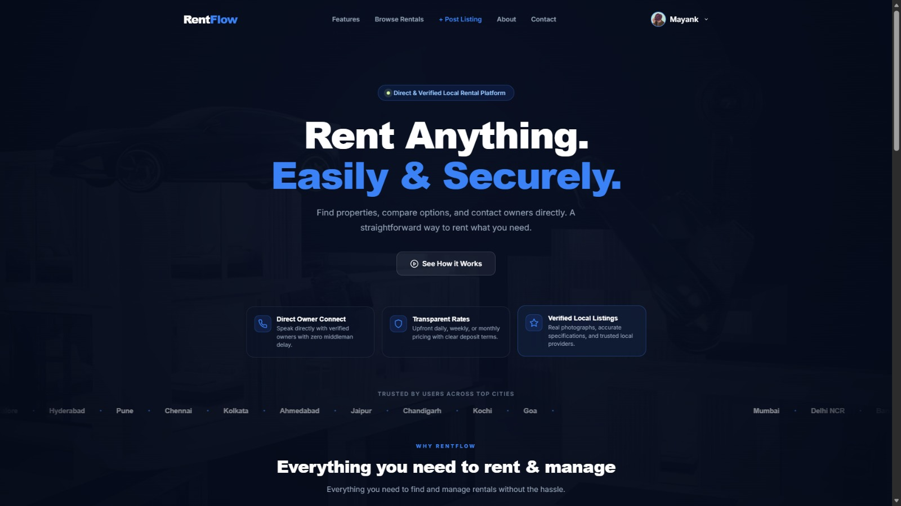
</p>

### 🔎 Browse Available Rentals

<p align="center">
  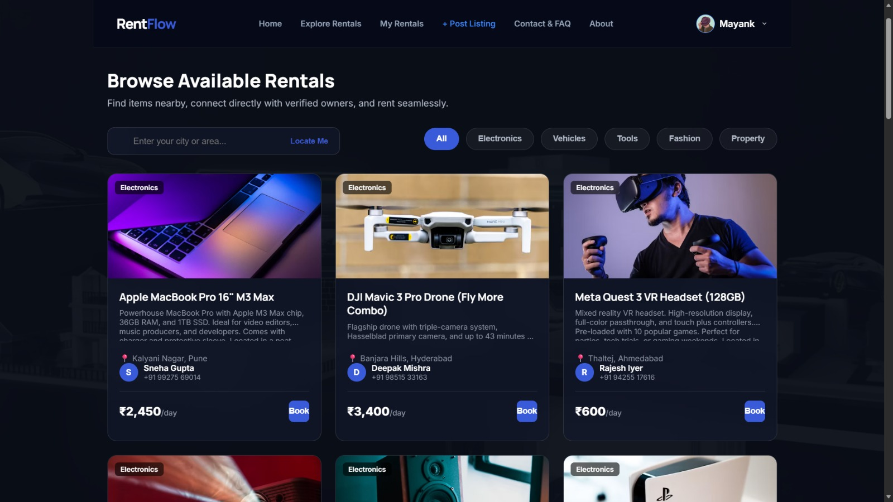
</p>

### ➕ Create a New Listing

<p align="center">
  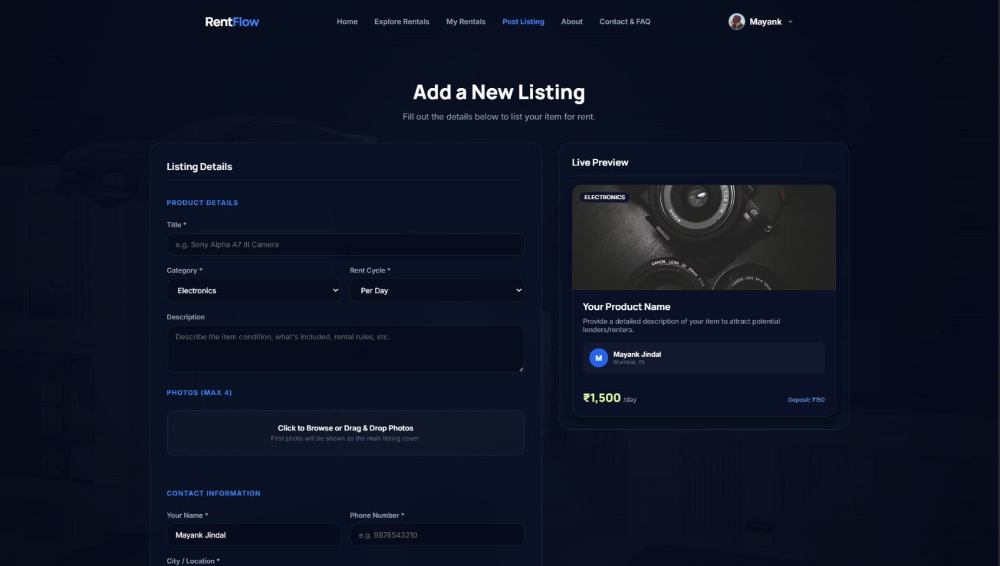
</p>

### 📄 Rental Receipt

<p align="center">
  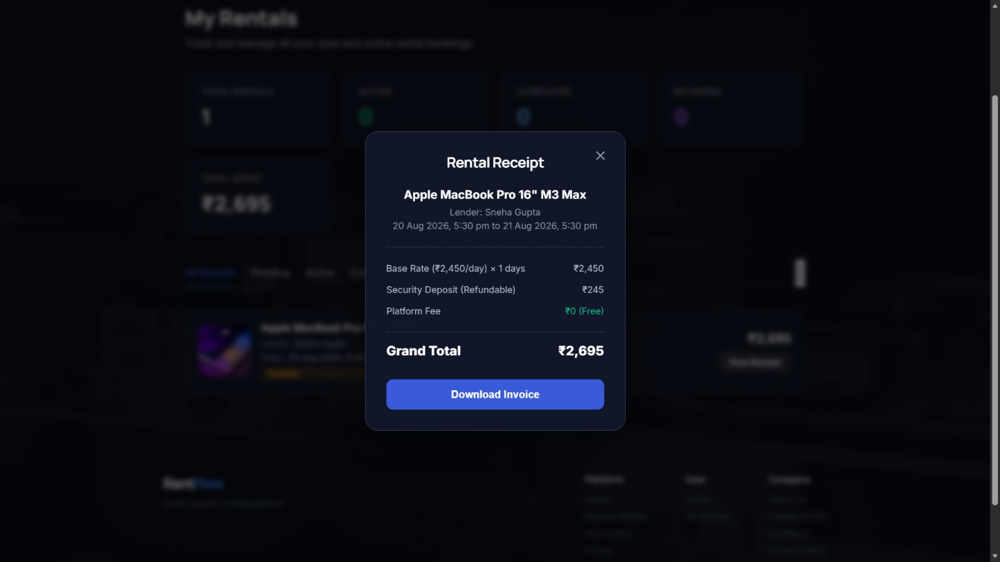
</p>

### 👤 User Profile

<p align="center">
  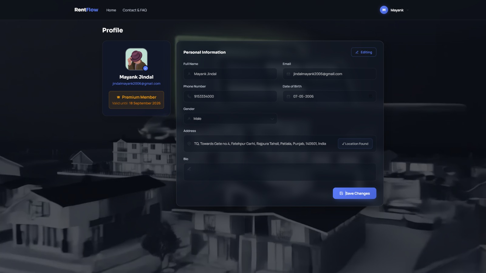
</p>

### ⭐ RentFlow Premium

<p align="center">
  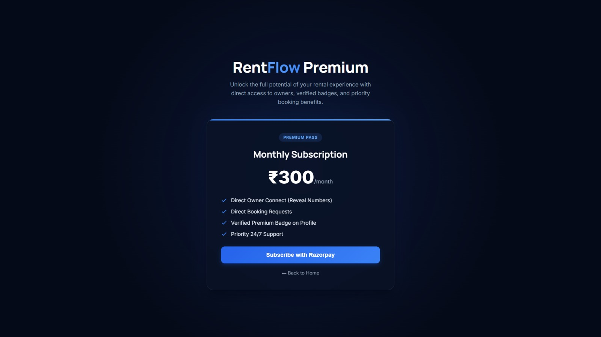
</p>

### 💬 Feedback

<p align="center">
  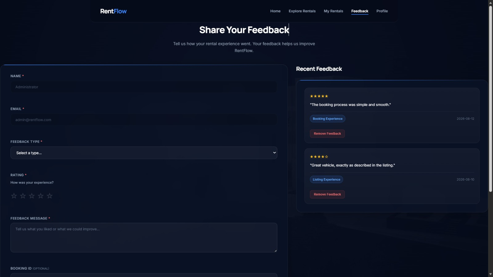
</p>

### 📞 Contact & FAQ

<p align="center">
  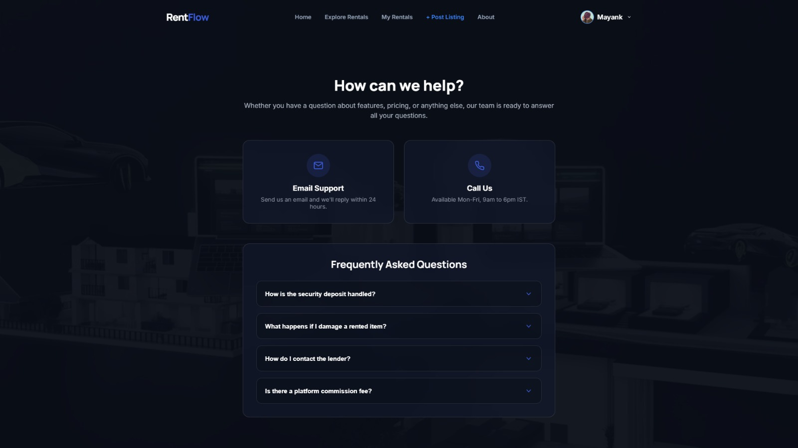
</p>

### ℹ️ About RentFlow

<p align="center">
  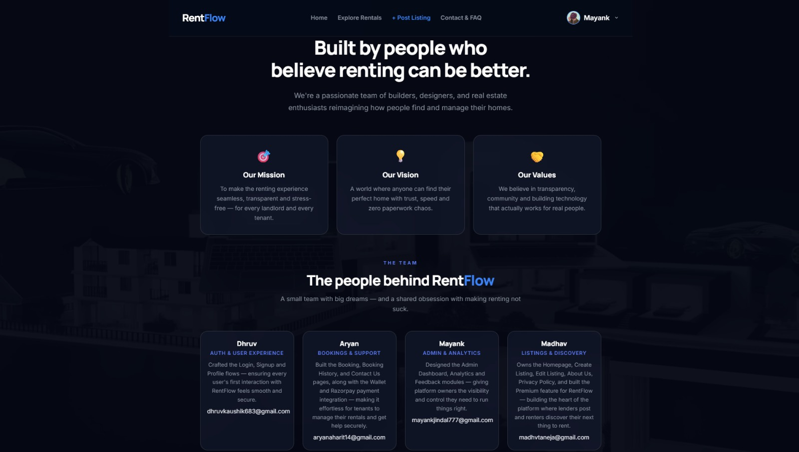
</p>

### 👨‍💼 Admin Dashboard

<p align="center">
  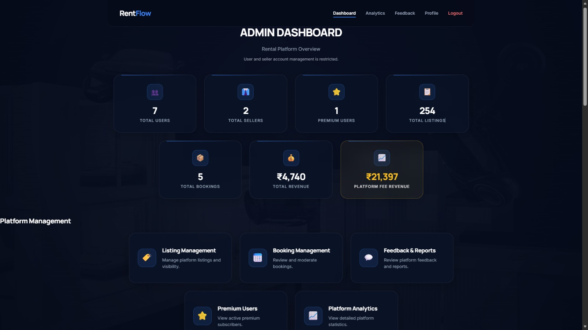
</p>

### 📊 Admin Analytics

<p align="center">
  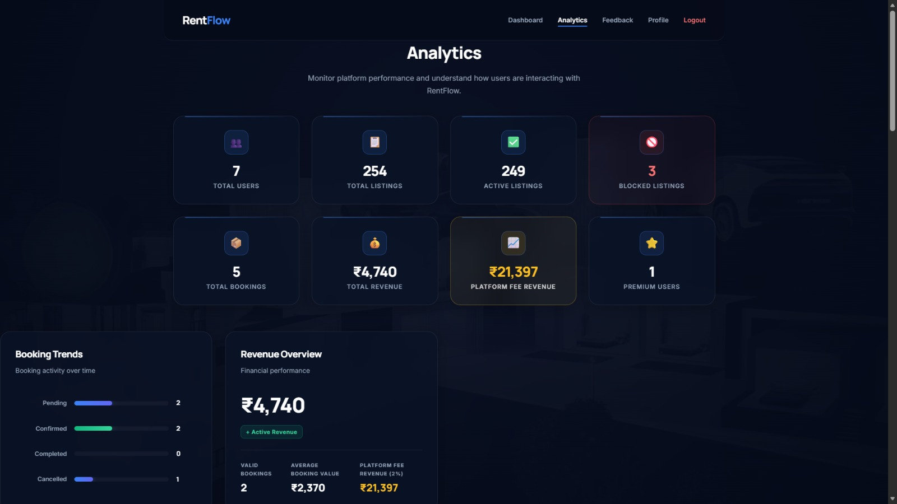
</p>

### 🛠️ Admin Listing & Booking Management

<p align="center">
  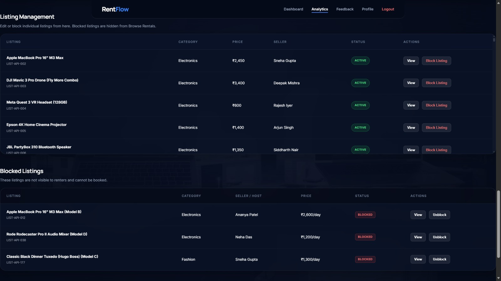
</p>

### 🚫 Listing Management & Blocked Listings

<p align="center">
  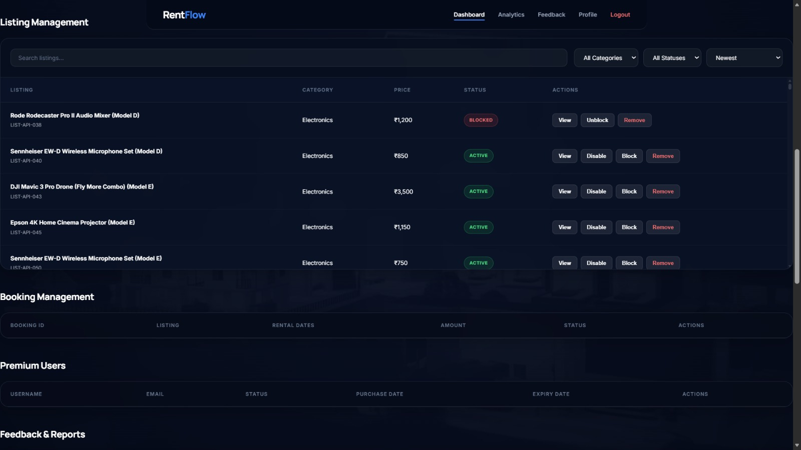
</p>

### 🚀 Upcoming Features

<p align="center">
  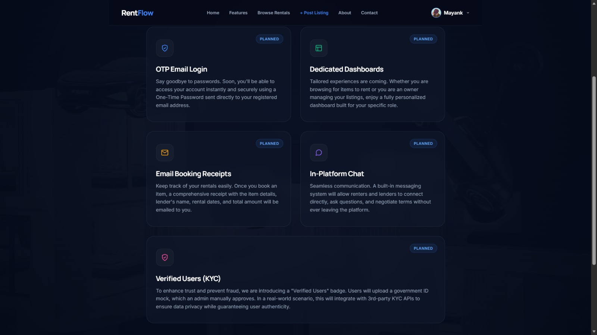
</p>

---

## Getting Started

### 1. Clone the repository

```bash
git clone <your-repository-url>
cd RentFlow-main
```

### 2. Open the project

RentFlow is a frontend application, so no Node.js, Python, Java, or database server is required for the current LocalStorage-based version.

For the best experience, run it using a local development server.

### 3. Using VS Code

Install the **Live Server** extension and:

1. Open the project folder.
2. Open `html/index.html`.
3. Right-click the file.
4. Select **Open with Live Server**.

The application will open in your browser.

### 4. Alternative

You can also open:

```text
html/index.html
```

directly in a browser, although a local server is recommended for more reliable behavior.

---

## 👥 Demo Accounts

The project currently contains seed users in `js/storage.js`.

### Admin

```text
Email: admin@rentflow.com
Password: Admin@123
Role: Admin
```

### Customer

```text
Email: rahul@example.com
Password: User@1234
Role: Customer
```

### Seller

```text
Email: aman@example.com
Password: User@1234
Role: Seller
```

Additional seeded users are also available in `js/storage.js`.

> **Security note:** These credentials are demo credentials for the frontend prototype. They must not be used as production administrator credentials.

---

## 💾 Data Storage

The current version uses the browser's **LocalStorage** instead of a backend database.

The central storage logic is handled by:

```text
js/storage.js
```

Important storage keys include:

```text
user
RentFlow_listings
rentflow_bookings
rentiq_feedback
current_user
```

The project initializes demo data when the corresponding LocalStorage keys do not already exist.

### Main stored entities

#### Users
Stores:
- Name
- Email
- Phone
- Password
- Role
- Premium status

#### Listings
Stores:
- Listing ID
- Title
- Category
- Price
- Status
- Date
- Seller information

#### Bookings
Stores:
- Booking ID
- Listing ID
- Renter
- Rental dates
- Total amount
- Booking status
- Booking date

#### Feedback
Stores:
- User information
- Feedback type
- Rating
- Message
- Booking reference
- Date
- Visibility status

---

### Customer

Customers can:
- Browse rentals
- Book available listings
- View rental history
- Manage their profile
- Submit feedback
- Access premium features

### Seller

Sellers can:
- Create listings
- Edit listings
- Manage their listings
- View booking requests
- Track settlements
- Manage seller-related information

### Admin

Administrators can:
- View platform statistics
- Manage listings
- Monitor bookings
- Review feedback
- Monitor users
- Manage premium users
- Block/unblock listings
- Handle listing removal requests
- Access analytics

---

## 📄 Main Pages

| Page | Purpose |
|---|---|
| `index.html` | Homepage and rental platform landing page |
| `signup.html` | Create a new account |
| `login.html` | User login |
| `booking.html` | Browse and book rentals |
| `booking-history.html` | View rental/booking history |
| `create_listings.html` | Create and manage seller listings |
| `edit-listing.html` | Edit an existing listing |
| `profile.html` | User profile and account settings |
| `premium.html` | Premium membership |
| `feedback.html` | Submit and view feedback |
| `contact.html` | Contact and FAQ |
| `about.html` | About RentFlow |
| `admin-dashboard.html` | Administration dashboard |
| `analytics.html` | Platform analytics |
| `policy.html` | Privacy policy and terms |
| `upcoming_features.html` | Planned/upcoming functionality |

---

## 🔄 Application Flow

```text
                    ┌──────────────┐
                    │   RentFlow   │
                    │    Home      │
                    └──────┬───────┘
                           │
              ┌────────────┴────────────┐
              │                         │
           Login                     Sign Up
              │                         │
              └────────────┬────────────┘
                           │
                     Authentication
                           │
             ┌─────────────┼─────────────┐
             │             │             │
          Customer       Seller        Admin
             │             │             │
             ▼             ▼             ▼
        Browse/Book    Create/Edit    Dashboard
        Rentals        Listings       Analytics
             │             │             │
             └─────────────┼─────────────┘
                           ▼ 
                      LocalStorage
```

---

## Important JavaScript Modules

### `storage.js`
Centralized LocalStorage management for:
- Users
- Listings
- Bookings
- Feedback
- Premium users
- Revenue calculations

### `rentflow-rental.js`
Shared rental/business utilities including:
- Listing normalization
- Booking calculations
- Rental duration
- Bill calculation
- Availability checking
- Date overlap detection
- Currency formatting
- User/session helpers
- Toast messages
- Location/geocoding helpers

### `login.js`
Handles:
- Normal login
- Google login
- JWT parsing
- Session creation
- Role-based redirects

### `signup.js`
Handles:
- Account registration
- Validation
- Google signup
- Terms & Conditions modal

### `booking.js`
Handles:
- Listing retrieval
- Search/filter/sort
- Location functionality
- Rental duration
- Pricing calculations
- Booking submission
- Premium checks

### `create_listings.js`
Handles:
- Listing creation
- Image uploads/previews
- Duplicate detection
- Pricing preview
- Seller dashboard
- Booking requests
- Settlements
- Wallet information

### `profile.js`
Handles:
- Profile loading
- Profile updates
- Profile image uploads
- Premium status
- Account settings
- Password change UI
- Location functionality

### `admin-dashboard.js`
Handles:
- Admin KPIs
- Listing management
- Booking management
- Feedback/reports
- Premium users
- Listing actions

### `analytics.js`
Handles:
- Booking analytics
- Revenue analytics
- Listing performance
- User analytics
- Category distribution
- Feedback analytics

---

## 🔐 Google Login Setup

The project uses **Google Identity Services**.

Before deploying the application, configure your Google OAuth client and replace the client configuration in the relevant JavaScript/HTML code with your own credentials.

For production:

- Use your own Google OAuth Client ID.
- Add your production domain to the authorized JavaScript origins.
- Do not expose private OAuth secrets in frontend code.
- Use a backend authentication flow for secure production authentication.

---

## 🌐 External Resources

The project currently uses external resources such as:

- Bootstrap 5.3.3 CDN
- Google Fonts
- Google Identity Services
- Nominatim/OpenStreetMap for location-related functionality
- Google Cloud

An internet connection may therefore be required for some features.

---

## 📱 Responsive Design

RentFlow is designed to work across:

- Desktop
- Laptop
- Tablet
- Mobile

The project includes:
- Responsive navigation
- Hamburger menu
- Flexible grids
- Mobile-friendly forms
- Responsive listing cards
- Adaptive dashboards
- Mobile profile interactions

---

## 🎨 Design System

The interface uses a modern rental-marketplace aesthetic with:

- Dark backgrounds
- Glassmorphism panels
- Blue accent colors
- Rounded cards
- Inter and Manrope fonts
- Background video
- Subtle borders and shadows
- Responsive layouts
- Modal-based interactions

---

## 🧪 Testing Checklist

Before presenting or deploying the project, test:

- [ ] User signup works
- [ ] Login works
- [ ] Google login is configured
- [ ] Correct role is saved in LocalStorage
- [ ] Customer is redirected correctly
- [ ] Seller can create a listing
- [ ] Seller can edit a listing
- [ ] Listings appear on the rental page
- [ ] Search/filter/sort works
- [ ] Booking calculation works
- [ ] Booking submission works
- [ ] Booking history displays correctly
- [ ] Profile information loads correctly
- [ ] Profile updates persist
- [ ] Logout clears the active session
- [ ] Premium status updates correctly
- [ ] Feedback submission works
- [ ] Admin dashboard displays data
- [ ] Analytics display correctly
- [ ] Mobile navigation works
- [ ] Theme switching works

---

## ⚠️ Current Architecture & Limitations

This version is primarily a **frontend prototype**.

Because data is stored in LocalStorage:

- Data is stored only in the user's browser.
- Different users/devices do not share the same database.
- Clearing browser storage removes application data.
- Authentication is not suitable for production.
- Passwords are currently handled client-side and should not be stored this way in a production system.
- Payments are not connected to a real payment gateway.
- Booking and listing data is not synchronized between users/devices.
- Administrative permissions are frontend-controlled.

---

## 🔮 Future Improvements

Potential next steps include:

1. Build a secure backend API.
2. Add a relational database such as PostgreSQL/MySQL.
3. Implement secure password hashing.
4. Add JWT/session-based authentication.
5. Add real Google OAuth authentication through the backend.
6. Add real payment processing.
7. Add cloud image storage.
8. Add real-time booking notifications.
9. Add seller/customer messaging.
10. Add booking conflict prevention at the server level.
11. Add email/SMS notifications.
12. Add production-grade authorization and role permissions.
13. Deploy the frontend and backend separately.
14. Add automated testing and CI/CD.
15. Add a real admin audit log.

---

## 🔒 Production Security Recommendations

Before using RentFlow in production:

- Never store plaintext passwords.
- Never rely only on LocalStorage for authorization.
- Validate all data on the server.
- Implement server-side role permissions.
- Use HTTPS.
- Protect API endpoints.
- Validate uploaded files.
- Sanitize user-generated content.
- Add rate limiting.
- Implement secure authentication/session expiration.
- Use a real database.
- Keep API keys and private credentials out of frontend code.

---

## 📌 Project Status

**Status:** Frontend rental marketplace prototype

**Current architecture:**  
`HTML + CSS + JavaScript + LocalStorage`

**Primary goal:**  
Provide a complete rental marketplace interface with customer, seller, and administrator workflows that can later be connected to a production backend.

---

## 👨‍💻 Development

When making changes:

1. Keep shared LocalStorage operations in `storage.js`.
2. Keep reusable rental calculations/utilities in `rentflow-rental.js`.
3. Keep page-specific logic inside its corresponding JavaScript file.
4. Keep page styling inside the corresponding CSS file.
5. Avoid duplicating authentication/session logic when a shared helper can be used.
6. Test all three user roles after authentication-related changes.
7. Clear or inspect LocalStorage when testing seeded/demo data.

### Reset Demo Data

To reset the browser's stored RentFlow data, open the browser console and run:

```javascript
localStorage.clear();
location.reload();
```

This will remove the current LocalStorage data and allow the application's seed data to be initialized again.

---

## 📜 License

This project is currently a project/demo application. Add an appropriate open-source license here if the repository will be publicly distributed.

---

## 🙌 Acknowledgements

Built using:

- HTML5
- CSS3
- JavaScript
- Bootstrap
- Google Identity Services
- Google Fonts
- OpenStreetMap/Nominatim
- jsPDF

---

**RentFlow — Rent Anything. Easily & Securely.**
